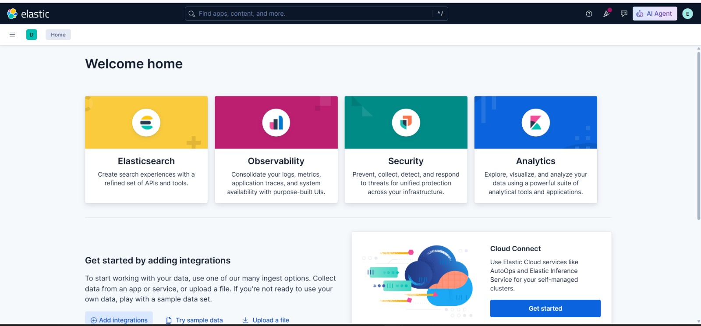
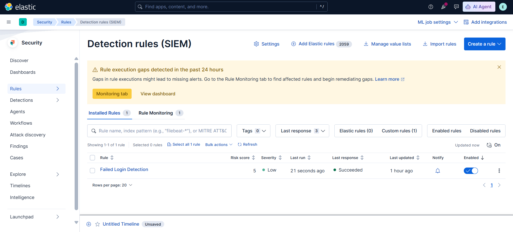
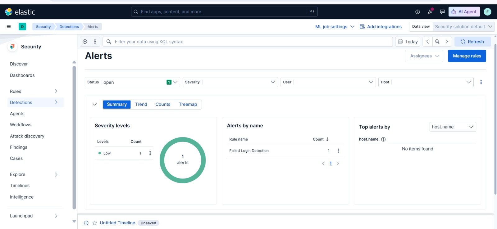

# Elastic SIEM Security Monitoring Dashboard

A beginner-friendly Security Information and Event Management (SIEM) project built using Elasticsearch, Kibana, Elastic Security, and Docker.

## Project Overview

This project demonstrates how security logs can be collected, normalized, visualized, monitored, and detected using the Elastic Security platform.

The project focuses on detecting failed authentication attempts and generating security alerts for suspicious login activity.

## Architecture

```text
Security Events
      ↓
Elasticsearch
      ↓
Security Logs Index
      ↓
Kibana / Elastic Security
      ↓
Detection Rule
      ↓
Failed Login Alert
```

## Technologies Used

* Elasticsearch 9.5.4
* Kibana 9.5.4
* Elastic Security
* Docker Desktop
* KQL
* JSON
* Windows

## Key Features

* Security log ingestion
* Log normalization
* Security monitoring dashboard
* Login success/failure analysis
* Top source IP tracking
* Login activity over time
* Custom KQL detection rule
* Failed authentication detection
* Security alert generation

## Dashboard

The dashboard provides security monitoring views including:

* Total login attempts
* Failed vs successful logins
* Top source IP addresses
* Login activity over time

## Detection Rule

### Failed Login Detection

The project uses the following KQL query:

```text
event.category : "authentication" and event.outcome : "failure"
```

The rule monitors the `security-logs*` data view and generates an alert when a failed authentication event is detected.

## Alert Testing

A test failed-login event was generated with:

* Username: `alerttest`
* Source IP: `192.168.1.100`
* Event category: `authentication`
* Outcome: `failure`

The Elastic detection rule successfully generated an alert for the test event.

## Project Workflow

1. Create security log data
2. Store logs in Elasticsearch
3. Normalize security events
4. Create a Kibana data view
5. Build a security monitoring dashboard
6. Create a failed-login detection rule
7. Enable the detection rule
8. Generate a test failed-login event
9. Verify the generated security alert

## Security Use Case

This project represents a simplified SOC monitoring workflow.

A security analyst can use this type of monitoring to identify suspicious authentication failures and investigate the associated usernames and source IP addresses.

## Learning Outcomes

Through this project, I gained practical experience with:

* SIEM concepts
* Elasticsearch
* Kibana
* Elastic Security
* Security log analysis
* KQL
* Detection rules
* Security alerts
* Docker-based deployment
* Basic SOC monitoring workflow

## Future Improvements

* Add Windows Event Logs
* Add SSH authentication monitoring
* Add brute-force detection
* Add IP-based threat intelligence
* Add automated alert notifications
* Integrate additional security data sources
## Project Screenshots

### SIEM Dashboard



### Failed Login Detection Rule



### Security Alert


